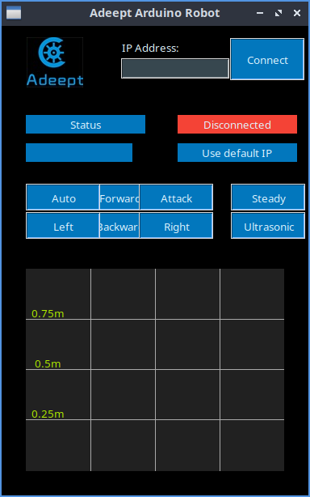
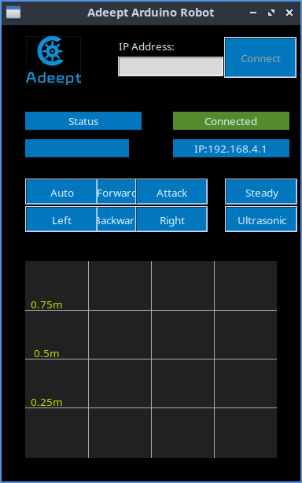

Distribution de travail : Lubuntu 24.04

#### 1/ Création du répertoire de travail 

```
util01@station54:~$ mkdir HEXAPOD
```

```
util01@station54:~$ cd HEXAPOD/
util01@station54:~/HEXAPOD$ 
```

#### 2/ Scanner les réseaux sans-fil.

```
util01@station54:~/HEXAPOD$ nmcli connection show
NAME                           UUID                                  TYPE      DEVICE 
ressf01                        0af28875-e2cf-4ac1-98d1-09f279fe50ac  wifi      wlo1   
lo                             2912e8f7-46c8-44ac-8272-b5171e94d58f  loopback  lo     
Adeept_ESP                     03b85917-fd1b-4665-aeba-a926e289980a  wifi      --     
Connexion filaire 1            d5e5983b-124e-39f7-84e8-3644c66362eb  ethernet  --     
...
util01@station54:~/HEXAPOD$ 
```


#### 3/ Allumer l'hexapod.

Le réseau wifi de l'hexapod est : Adeept_ESP
Avec le mot de passe : 12345678


#### 4/ Se connecter sur le réseau wifi de l'hexapod.

```
util01@station54:~/HEXAPOD$ nmcli device wifi connect "Adeept_ESP" password 12345678
Périphérique « wlo1 » activé avec « 03b85917-fd1b-4665-aeba-a926e289980a ».
util01@station54:~/HEXAPOD$ 
```

Il se peut qu'il faille exécuter la commande plusieurs fois afin que la connexion wifi s'établisse correctement.


#### 5/ Vérification.

```
util01@station54:~/HEXAPOD$ nmcli connection show
NAME                           UUID                                  TYPE      DEVICE 
Adeept_ESP                     03b85917-fd1b-4665-aeba-a926e289980a  wifi      wlo1   
lo                             2912e8f7-46c8-44ac-8272-b5171e94d58f  loopback  lo     
Connexion filaire 1            d5e5983b-124e-39f7-84e8-3644c66362eb  ethernet  --     
ressf01                        0af28875-e2cf-4ac1-98d1-09f279fe50ac  wifi      --     
...
util01@station54:~/HEXAPOD$ 
```


#### 6/ Lancer la télécommande de l'hexapod.

```
util01@station54:~/HEXAPOD$ sudo python3 remotecontrol.py
```




#### 7/ Se connecter au robot.

Le bouton [Disconnected] est en rouge.
Cliquer sur le bouton [Connect].
Au bout de quelques secondes, le bouton [Connected] devient vert.




#### 8/ Les déplacements.

[Forward] : Pour avancer
[Backward] : Pour reculer
[Left] : Pour tourner vers la gauche
[Right] : Pour tourner vers la droite
[Steady] : Pour être en repos


